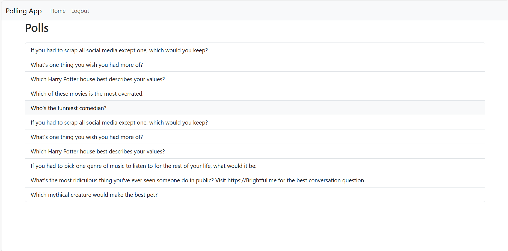

# Polling App

This is a simple polling application built using Django framework. It allows users to create, view, modify, and delete polls with associated choices. Users can also vote on choices within a poll.

## Screenshots

### Home Page / login / Sign UP

### Create Poll Page

adding new choices to a question with 2 question the default.

### List of Polls

### Detail of Polls

## Work in Progress

Please note that this project is still under development. We'll be adding more functionalities and improvements in the future. Stay tuned for updates!